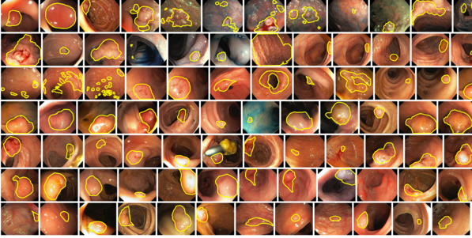

# EDD2020: Endoscopy Disease Detection and Segmentation Challenge 

#### About:
Endoscopy is a widely used clinical procedure for the early detection of numerous cancers (e.g., nasopharyngeal, oesophageal adenocarcinoma, gastric, colorectal cancers, bladder cancer etc.), therapeutic procedures and minimally invasive surgery (e.g., laparoscopy). During this procedure an endoscope is used; a long, thin, rigid or flexible tube with a light source and camera at the tip to visualise the inside of affected organs on an external screen. Quantitative clinical endoscopy analysis is immensely challenging due to inevitable video frame quality degradation from various imaging artefacts to the non-planar geometries and deformations of organs.

In the framework of **Endoscopy Computer Vision Challenges on Segmentation and Detection (EndoCV2020)** we propose to organise two sub-challenges:

Sub-challenge I:  Endoscopy Artefact Detection and Segmentation (EAD2020)

Sub-challenge II: **[Endoscopy Disease Detection and Segmentation (EDD2020)](https://edd2020.grand-challenge.org)**

Each sub-challenge consists of detection, semantic segmentation and out-of-sample generalisation tasks for each unique dataset.

- Multi-class artefact detection: Localization of bounding boxes and class labels for 5  disease/pre-cancerous classes for given frames.

- Region segmentation: Precise boundary delineation of detected artefacts. 

- Detection generalization: Detection performance independent of specific data type and source.

#### Regarding data formats
[1] [Class labels](https://github.com/sharibox/EDD2020/blob/master/class_list.txt) with bounding boxes are provided for the detection task 

[2] Image masks per region annotation is provided in the form of '.tif' format with 255 gray values for TPs.
`MaskFileFormat: FileName_ClassLabel_mask.tif`

[3] Both bounding boxes and sematic segmentation includes same class labels

**ClassLabels:** ``{'BE', 'suspicious', 'HGD' , 'cancer'  'polyp'}``

#### Please check EAD2019 repo for other usage (most part of software can also be used for EAD2020)

- [annotation file format converters](https://github.com/sharibox/EAD2019/tree/master/fileFormatConverters)

- [test script](https://github.com/sharibox/EAD2019/tree/master/scripts) 

- [configuring your training images and annotations](https://github.com/sharibox/EAD2019/tree/master/annotationImages_and_labels) 

- [detection evaluation: mAP and IoU](https://github.com/sharibox/EAD2019/tree/master/evaluation_mAP-IoU)

- [via to mask image converted](https://github.com/sharibox/EAD2019/blob/master/jsonViaAnnotation_maskImage.py)

- [semantic evaluation: DICE-JACCARD](https://github.com/sharibox/EAD2019/tree/master/evaluation_semantic)

 
 
